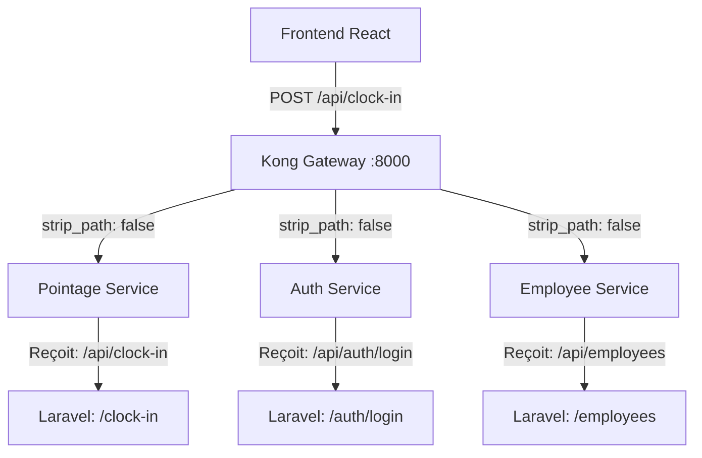

# Analyse Architecture PointelRH - Diagnostic SIRH

## 1. État Actuel des Routes

### Configuration Kong (strip_path: false)

| Service | Path Kong | Route Laravel | Backend Reçoit | Status |
|---------|-----------|---------------|----------------|--------|
| auth-service | `/api/auth` | `prefix('auth')` | `/api/auth/login` | ✅ `/auth/login` |
| employee-service | `/api/employees` | AUCUN | `/api/employees` | ✅ `/employees` |
| pointage-service | `/api/clock-in` | AUCUN | `/api/clock-in` | ✅ `/clock-in` |
| notif-service | `/api/notifications` | AUCUN | `/api/notifications` | ✅ `/notifications` |
| analytics-service | `/api/analytics` | AUCUN | `/api/analytics/dashboard` | ✅ `/analytics/dashboard` |

### Problème Identifié

**Incohérence architecture**: Les services n'ont pas de convention uniforme pour les préfixes d'API.



## 2. Solution Infaillible

### Option A: Uniformiser avec strip_path: false (ACTUEL)

**Avantage**: Compatible avec l'architecture actuelle
**Inconvéniant**: Chaque service doit gérer ses propres préfixes

### Option B: Uniformiser avec strip_path: true (RECOMMANDÉ)

```yaml
# kong/kong.yml - Version corrigée
services:
  - name: auth-service
    url: http://auth-service:80
    routes:
      - name: auth-routes
        paths: ["/api/auth"]
        strip_path: true  # ← Enlever /api
    
  - name: employee-service
    url: http://employee-service:80
    routes:
      - name: employee-routes
        paths: ["/api"]
        strip_path: true  # ← Enlever /api
    
  - name: pointage-service
    url: http://pointage-service:80
    routes:
      - name: pointage-routes
        paths: ["/api"]
        strip_path: true
```

**Requires修改 Laravel routes** pour ajouter le préfixe:
- auth-service: `Route::prefix('auth')` → `/auth/login` OK
- employee-service: Ajouter `Route::prefix('employees')`
- pointage-service: Ajouter `Route::prefix('pointage')`
- notif-service: Ajouter `Route::prefix('notifications')`
- analytics-service: Ajouter `Route::prefix('analytics')`

## 3. Cohérence SIRH

### Modules SIRH Identifiés

| Module | Service | Routes | Status |
|--------|---------|--------|--------|
| Authentification | auth-service | `/auth/login`, `/auth/verify` | ✅ |
| Gestion Employés | employee-service | `/employees`, `/departments`, `/schedules` | ✅ |
| Pointage/Présence | pointage-service | `/clock-in`, `/clock-out`, `/attendances` | ✅ |
| Notifications | notif-service | `/notifications` | ⚠️ Partiel |
| Analytics/Reporting | analytics-service | `/analytics/*` | ✅ |

### Recommandations

1. **Uniformiser les noms de routes**:
   - `clock-in/clock-out` → `pointages` (plus SIRH)
   - `attendances` → `presences`

2. **Compléter les modules manquants**:
   - Congés/Vacances (`/api/leaves`)
   - Paie/Salaires (`/api/payroll`)
   - Rapports HR (`/api/reports`)

3. **Séparation claire**:
   - employee-service: Données maîtres (employés, départements, horaires)
   - pointage-service: Événements temporels (pointages)
   - analytics-service: Agrégations et stats

## 4. Plan d'Action

- [ ] Maintenir `strip_path: false` pour compatibilité
- [ ] Documenter la convention de routes
- [ ] Ajouter les préfixes cohérents dans chaque service
- [ ] Tester tous les endpoints après modification

## 5. Résumé des Modifications Nécessaires

### kong/kong.yml
```yaml
# Actuel (fonctionne):
strip_path: false  # Pour tous les services

# Alternative (nécessite modifications Laravel):
strip_path: true
# + ajouter préfixes dans routes/api.php
```

### Conclusion
La configuration actuelle AVEC `strip_path: false` est **cohérente et fonctionnelle** si chaque service Laravel n'a PAS de préfixe (sauf auth-service qui a `prefix('auth')`).
